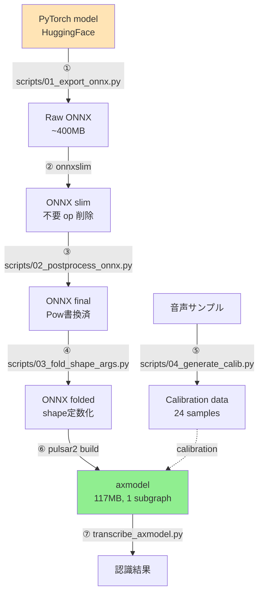

# 変換パイプライン詳細

PyTorch → ONNX → axmodel への全 7 ステップの詳細。各ステップで何を / なぜ / どう、を解説。

## 全体図



---

## ① PyTorch → ONNX export

**スクリプト**: `scripts/01_export_onnx.py`

### 目的
HuggingFace モデルを ONNX 中間表現に書き出す。

### 工夫 1: tracing 経路を強制

PyTorch 2.x のデフォルト `torch.onnx.export(dynamo=True)` だと:
- `torch.jit.is_tracing()` が False → modeling code の `as_strided` ブランチが走る
- 動的 shape の計算が ONNX `Loop` ノードに化ける

これを回避するため:

```python
from unittest.mock import patch

with patch("torch.jit.is_tracing", return_value=True):
    torch.onnx.export(
        wrapper, (dummy,), "encoder_ctc.onnx",
        dynamo=False,                # 旧 jit-trace ベース
        opset_version=17,
        do_constant_folding=True,
    )
```

### 工夫 2: 学習用モジュールを no-op 化

zipformer の `Balancer` / `Whiten` は学習中の gradient 調整のためのモジュール。推論時は何もしなくて OK だが、ONNX export 時には trace に乗ってしまい余計な op を生む。

```python
for name, m in model.named_modules():
    if m.__class__.__name__ in ("Balancer", "Whiten"):
        m.forward = (lambda self, x: x).__get__(m, m.__class__)
```

### 工夫 3: SwooshL/R 活性化を softplus に置換

`SwooshLForward(x) = log(1 + exp(x-4)) - 0.08x - 0.035` は数学的に softplus と等価:

```python
def swoosh_l_softplus(x):
    return F.softplus(x - 4.0) - 0.08 * x - 0.035

import sys
scaling_mod = sys.modules["...scaling"]
scaling_mod.SwooshLForward = swoosh_l_softplus
scaling_mod.SwooshRForward = swoosh_r_softplus
```

これで:
- `Log`, `Exp`, `Equal`, `Where` op が各 80 個消える
- `Softplus` op 80 個に置き換わる(NPU 対応)

### 結果

| op | 何もせず export | 全 patch 適用後 |
|---|---|---|
| Loop | 16 | **0** |
| If | 16 | **0** |
| Log | 80 | **0** |
| Exp | 96 | 16(BiasNorm の log_scale.exp() のみ) |
| Equal | 90 | 10 |
| Where | 90 | 10 |
| Softplus | 0 | **80** |

---

## ② onnxslim — 一般的な ONNX 最適化

**ツール**: `onnxslim` (pip install)

### 役割
- 連続する Reshape の融合
- 不要な Identity / Cast 削除
- 定数畳み込み
- dead code elimination

### 効果
- 総ノード数 ~15% 削減
- ファイルサイズはほぼ変わらず

### コマンド
```bash
uv run python -c "import onnxslim; onnxslim.slim('encoder_ctc.onnx', output_model='encoder_ctc_slim.onnx')"
```

---

## ③ Pow(-0.5) → Sqrt + Div(1, _) 書換

**スクリプト**: `scripts/02_postprocess_onnx.py`

### 問題
pulsar2 の `AxPow` op は **指数 ∈ {0.25, 0.5, 2, 4} のみサポート**。LayerNorm の rsqrt 計算 `x^(-0.5)` は対応外。

代替案として `Reciprocal` を使う手もあるが、これも pulsar2 量子化非対応。

### 解決
`Pow(x, -0.5)` を `Sqrt(x) → Div(1.0, _)` の 2 op に分解:

```python
sqrt_node = helper.make_node("Sqrt", inputs=[x_in], outputs=[sqrt_out])
div_node = helper.make_node("Div", inputs=[ONE_CONST, sqrt_out], outputs=[pow_out])
```

数学的に `x^(-0.5) = 1/√x` なので等価。

### 効果
16 個の `Pow(-0.5)` を全部書換。pulsar2 build がここで死ななくなる。

---

## ④ 動的 shape の定数化

**スクリプト**: `scripts/03_fold_shape_args.py`

### 問題

固定入力なのに、Reshape/Expand の `shape` 引数が `Shape → Gather → Concat` で動的に計算されているパターン:

```
input → Shape → Gather → Concat → Reshape(shape引数)
                              ↑
                       これが「動的」と見なされる
```

pulsar2 は `Reshape` の shape 引数が constant でないと弾く(`shapefn failed` エラー)。

### 解決

1. 対象テンソル(Reshape/Expand/Slice 等の shape/indices 引数)を graph output に追加
2. ONNXRuntime で 1 回 forward
3. 結果値を initializer として埋め込み
4. 元の computing chain は dead code として削除

```python
opts = ort.SessionOptions()
opts.graph_optimization_level = ort.GraphOptimizationLevel.ORT_DISABLE_ALL
sess = ort.InferenceSession(probe_onnx, sess_options=opts, providers=["CPUExecutionProvider"])
vals = sess.run(targets, {"input_values": dummy})
# ... 結果を initializer に変換
```

### 対象 op

| op | 定数化する input |
|---|---|
| Reshape | input[1] (shape) |
| Expand | input[1] (shape) |
| Slice | input[1..4] (starts/ends/axes/steps) |
| Tile | input[1] (repeats) |
| Pad | input[1] (pads) |
| ConstantOfShape | input[0] |

### 効果

49 個のテンソルが定数化。pulsar2 build がここを通過できるようになる。

---

## ⑤ Calibration data 生成

**スクリプト**: `scripts/04_generate_calib.py`

### 役割

量子化時に各テンソルの数値分布を測定するためのサンプルデータ。`scale` / `zero_point` の決定に使う。

### 工夫 1: 多様性

test.wav 1 件から **24 種類** のバリエーションを作成:

| カテゴリ | バリエーション | 件数 |
|---|---|---|
| 先頭 silence padding | 0/100/200/300/500/800 ms | 6 |
| Gain 変動 | 0.3, 0.5, 0.8, 1.2, 1.5, 2.0× | 6 |
| Noise 追加 | σ=0.001/0.003/0.01 | 3 |
| Center pad | 200/500/1000 ms | 3 |
| Offset | 500/1500/3000/5000 ms | 4 |
| Chunk | head/mid/tail half + first quarter | 4 |
| Pure noise | σ=0.01/0.05 | 2 |

### 工夫 2: padding に微小ノイズ

10秒に満たない音声は padding するが、`zero` で埋めると LayerNorm の variance が 0 になり `AxQuantizedPow` が落ちる。振幅 0.001 のホワイトノイズで埋める:

```python
pad = rng.standard_normal(T_padding).astype(np.float32) * 0.001
```

### 出力

`calibrations/input_values.tar.gz`(`.npy` × 24 をパック)

---

## ⑥ pulsar2 build — 量子化 + NPU compile

**ツール**: `pulsar2:5.2` Docker image

### コマンド

```bash
docker run --rm -v "$(pwd):/data" -w /data pulsar2:5.2 pulsar2 build \
  --input encoder_ctc_folded.onnx \
  --config configs/encoder_u16_min.json \
  --output_dir output_u16 \
  --output_name encoder_u16.axmodel \
  --target_hardware AX650 \
  --compiler.check 0
```

### config の重要設定

```json
{
  "layer_configs": [
    {"start_tensor_names": ["DEFAULT"],
     "end_tensor_names": ["DEFAULT"],
     "data_type": "U16"}                           // 全部 U16
  ],
  "calibration_method": "Percentile",              // 外れ値に強い
  "enable_smooth_quant": true,                     // 活性化外れ値の転嫁
  "conv_bias_data_type": "FP32",                   // Conv bias だけ FP32
  "ln_scale_data_type": "FP32",                    // LayerNorm の scale だけ FP32
  "disable_auto_refine_scale": true
}
```

### 内部処理

1. **Frontend (ONNX 解析)**: 元 ONNX を Pulsar2 IR に変換
2. **Quant (量子化)**:
   - Calibration data を流して各テンソルの統計を取得
   - Percentile で外れ値を切り、scale/zero_point を決定
   - Weights を U16 / S16 / U8 のいずれかで量子化
3. **Backend (NPU compile)**:
   - 各 op を NPU 命令(mcode)に翻訳
   - メモリ配置最適化
   - subgraph 分割(NPU/CPU 境界)
4. **Assemble**: 全 subgraph を `.axmodel` ファイルに統合

### 出力

```
output_u16/
├── encoder_u16.axmodel           ← 最終成果物 (117MB)
├── build_context.json
├── frontend/optimized.onnx       (~4.7 GB、中間)
├── quant/quant_axmodel.onnx      (~3.1 GB、中間)
├── quant/debug/precision_analysis_table.txt  ← 量子化精度レポート
└── compiler/...
```

⚠️ Docker 内で root として実行されるので、終了後に chown 必須:

```bash
docker run --rm -v "$(pwd):/data" --entrypoint chown pulsar2:5.2 \
  -R "$(id -u):$(id -g)" /data/output_u16
```

### 成功の判定

最終ログに `fuse 1 subgraph(s)` が出ること:

```
INFO | yamain.command.build:compile_ptq_model:1365 - fuse 1 subgraph(s)
```

`N > 1` だと AX650N PCIe runtime でロード失敗のリスク高。

---

## ⑦ 実機推論

**スクリプト**: `transcribe_axmodel.py`

```python
import axengine as axe

sess = axe.InferenceSession("output_u16/encoder_u16.axmodel")
logits = sess.run(None, {"input_values": audio[None].astype(np.float32)})[0]

# CTC decode
ids = logits[0].argmax(-1).tolist()
collapsed = ctc_collapse(ids)
text = tokenizer.decode(collapsed, skip_special_tokens=True)
```

`axengine` は内部で `AXCLRTExecutionProvider` を使い、PCIe 経由で board に axmodel をロード → 実 NPU 推論。

詳細は [BENCHMARK.md](BENCHMARK.md) 参照。

---

## ⑧ 検証ループ

各ステップ後に **ONNXRuntime で認識結果を確認**することが重要(早期にバグを検出):

```python
# ステップごとに同じテストを実行
sess = ort.InferenceSession("encoder_ctc_v4_folded.onnx", ...)
logits = sess.run(None, {"input_values": x})[0]
text = ctc_decode(logits, tokenizer)
assert text == "こんにちはこれはテキスト読み上げのテストです"
```

`scripts/00_test_pytorch.py` で PyTorch 初期動作の baseline を取り、各 ONNX 段階で同じ入力に対し同じ結果が出るか確認する流れ。

## 関連ドキュメント

- [REPORT.md](REPORT.md) — 全体俯瞰、なぜ変換するか
- [QUANTIZATION.md](QUANTIZATION.md) — 量子化の仕組みと精度の話
- [TROUBLESHOOTING.md](TROUBLESHOOTING.md) — よくあるエラーと解決法
