# 日本語 ASR モデルを AX650N NPU で動かすまで

**対象モデル**: `reazon-research/japanese-zipformer-base-k2-rs35kh`(CTC 日本語 ASR、Zipformer2 アーキテクチャ)
**ターゲットハードウェア**: AX650N PCIe ボード(AXera-tech)
**達成性能**: 推論 71.5ms / RTF 0.0071(リアルタイムの 138 倍速、CPU 比 4.4 倍速)

このドキュメントは全体俯瞰。詳細は以下を参照:
- [PIPELINE.md](PIPELINE.md) — 各変換ステップの実装詳細
- [QUANTIZATION.md](QUANTIZATION.md) — 量子化の仕組みと精度
- [TROUBLESHOOTING.md](TROUBLESHOOTING.md) — 遭遇した 7 つのエラー対応
- [BENCHMARK.md](BENCHMARK.md) — 性能評価の詳細
- [GLOSSARY.md](GLOSSARY.md) — 用語集

---

## 目次

1. [なぜモデル変換が必要か](#1-なぜモデル変換が必要か)
2. [変換の全体像](#2-変換の全体像)
3. [元モデルの構造](#3-元モデルの構造)
4. [変換パイプライン詳細](#4-変換パイプライン詳細)
5. [量子化の仕組み](#5-量子化の仕組み)
6. [サブグラフ問題](#6-サブグラフ問題)
7. [変換前後の比較](#7-変換前後の比較)
8. [まとめ](#8-まとめ)

---

## 1. なぜモデル変換が必要か

### 1.1 デプロイ先の制約

クラウドの GPU で動くモデルが、エッジ NPU でそのまま動くわけではありません。

```
┌─────────────────────────────────────────────────────────────┐
│                  デプロイ先による違い                          │
├─────────────────────────────────────────────────────────────┤
│                                                              │
│  クラウド GPU (NVIDIA)        エッジ NPU (AX650N)           │
│  ─────────────────────         ─────────────────────         │
│  • FP32 / FP16 自由            • U8 / U16 量子化中心         │
│  • PyTorch / TF 直接           • 専用形式 (.axmodel)         │
│  • 動的 shape OK               • 固定 shape のみ            │
│  • 制御フロー (If/Loop) OK     • 制御フロー 非対応          │
│  • メモリ 16-80 GB             • CMM 7 GB / システム 1 GB   │
│  • 電力 300-500 W              • 電力 5-15 W                │
│  • インターネット接続必須       • オフライン動作可能          │
│                                                              │
└─────────────────────────────────────────────────────────────┘
```

### 1.2 NPU を使うメリット

- **エネルギー効率**: 同じ性能を 1/30 の電力で実現
- **オフライン**: ネット切断でも動作 → プライバシー保護、低遅延
- **コスト**: クラウド API より圧倒的に安価(長期運用時)
- **専用ハード**: 行列演算が NPU の得意分野

### 1.3 変換が必要な理由

PyTorch モデルをそのまま NPU で動かせない理由:

| 制約 | PyTorch (GPU) | AX650N NPU |
|---|---|---|
| 数値表現 | FP32(浮動小数点) | **U16/S16/U8(整数量子化)** |
| 入力 shape | 任意 (Dynamic) | **固定** |
| 制御フロー | `if`, `for`, `while` 動作 | **静的グラフのみ** |
| サポート op | 数千種類 | **数十種類(基本演算のみ)** |
| メモリレイアウト | row-major / col-major 自由 | **NPU 専用フォーマット** |
| 実行モデル | Python interpreter | **コンパイル済み mcode** |

→ これらのギャップを埋めるのが「モデル変換」

---

## 2. 変換の全体像

### 2.1 5 段階のパイプライン

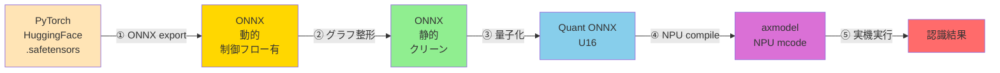

### 2.2 各段階で何をするか

| 段階 | 入力 | 出力 | 主なツール | 目的 |
|---|---|---|---|---|
| ① ONNX export | PyTorch | 動的 ONNX | `torch.onnx.export` | 中間表現に変換 |
| ② グラフ整形 | 動的 ONNX | 静的 ONNX | `onnxslim`, 自作 script | NPU 互換に整形 |
| ③ 量子化 | FP32 ONNX | U16 ONNX | pulsar2 `build` | データ型を整数に |
| ④ NPU compile | U16 ONNX | `.axmodel` | pulsar2 `build` | NPU mcode 生成 |
| ⑤ 実機実行 | `.axmodel` + 音声 | テキスト | pyaxengine | 推論 |

---

## 3. 元モデルの構造

### 3.1 ZipformerForCTC 全体像

```
入力: raw waveform (B, T_samples=160000) float32
     │
     ▼
┌─────────────────────────────────────────┐
│ feature_extractor                       │
│  Wav2Vec2 風 conv1d × 7 層              │
│  ストライド合計 320x (160000 → 500)      │
│  入力: (B, 160000)                       │
│  出力: (B, 512, 500)                     │
└─────────────────────────────────────────┘
     │
     ▼
┌─────────────────────────────────────────┐
│ post_extract_proj + layer_norm          │
│  (B, 500, 512) → (B, 500, 192)          │
└─────────────────────────────────────────┘
     │
     ▼
┌─────────────────────────────────────────┐
│ Zipformer2 encoder (6 stages)           │
│  ┌────────────────────────────────────┐ │
│  │ Stage 0: dim 192, downsample 1     │ │
│  │   ├ self_attention × 2             │ │
│  │   ├ conv_module                    │ │
│  │   └ feedforward                    │ │
│  ├────────────────────────────────────┤ │
│  │ Stage 1: dim 256, downsample 2     │ │
│  │   layers: 2                        │ │
│  ├────────────────────────────────────┤ │
│  │ Stage 2: dim 448, downsample 4     │ │
│  │   layers: 3                        │ │
│  ├────────────────────────────────────┤ │
│  │ Stage 3: dim 768, downsample 8     │ │ ← 最深
│  │   layers: 4                        │ │
│  ├────────────────────────────────────┤ │
│  │ Stage 4: dim 448, downsample 4     │ │
│  │   layers: 3                        │ │
│  ├────────────────────────────────────┤ │
│  │ Stage 5: dim 192, downsample 2     │ │
│  │   layers: 2                        │ │
│  └────────────────────────────────────┘ │
│  各 layer: Conformer ブロック           │
│   ├ feed_forward1                       │
│   ├ self_attention (RelPos + 通常)       │
│   ├ conv_module1                        │
│   ├ feed_forward2                       │
│   ├ conv_module2                        │
│   └ feed_forward3                       │
│  計 16 attention layers                 │
└─────────────────────────────────────────┘
     │
     ▼
┌─────────────────────────────────────────┐
│ downsample_output (5 → 1 のチャンク化)   │
│ ctc_head (Linear: 192 → 5230)           │
└─────────────────────────────────────────┘
     │
     ▼
出力: CTC logits (B, 499, 5230) float32
```

### 3.2 推論フロー(CTC デコード)

```
        音声 wav (16kHz mono)
            │
            ▼
     ┌──────────────┐
     │  encoder     │  ← この部分を NPU 化
     │  (axmodel)   │
     └──────────────┘
            │
            ▼
     logits (B, T, 5230)
            │
            │ argmax per frame
            ▼
     IDs:    [_, _, _, "こ", "こ", _, "ん", _, "に", "に", "に", _, ...]
            │
            │ CTC collapse(連続削除 + blank 除去)
            ▼
     IDs:    ["こ", "ん", "に", ...]
            │
            │ tokenizer.decode
            ▼
     "こんにちは..."
```

---

## 4. 変換パイプライン詳細

### 4.1 ① PyTorch → ONNX export

**問題**: そのまま export すると `Loop` / `If` ノードが大量発生する

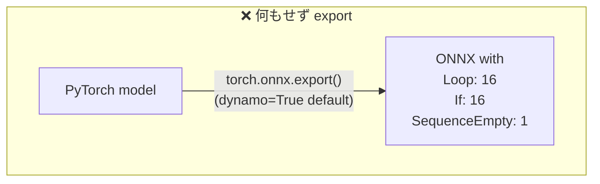

**原因**: `RelPositionMultiheadAttentionWeights` 内に動的 indexing(`torch.arange(-1, time-1, -1)`) がある。これは Python の `range(...)` ループとして trace され、ONNX で `Loop` 化される。

**解決**: tracing 経路を強制し、modeling 側のクリーン実装を使う:

```python
from unittest.mock import patch

with patch("torch.jit.is_tracing", return_value=True):
    torch.onnx.export(
        model, (dummy,), "encoder_ctc.onnx",
        dynamo=False,            # 重要: 旧 tracer を使う
        opset_version=17,
    )
```

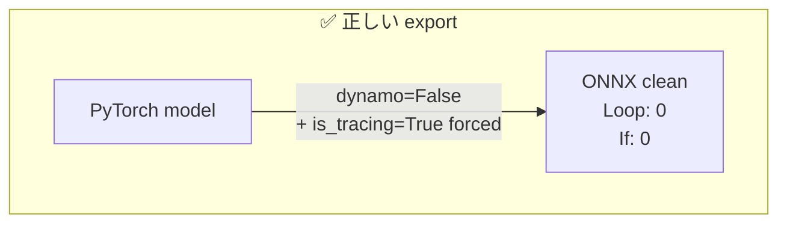

### 4.2 ① さらに modeling code を patch

ONNX export 後も `Log/Exp/Equal/Where` が各 80 個出る。これらは zipformer 特有の **手書き Swoosh activation**:

```python
# scaling.py の元コード(問題あり)
def SwooshLForward(x):
    x_offset = x - 4.0
    log_sum = (1.0 + x_offset.exp()).log()                   # ← Log + Exp + Add
    log_sum = torch.where(log_sum == float("inf"),           # ← Equal + Where
                          x_offset, log_sum)
    return log_sum - 0.08 * x - 0.035
```

数学的に等価な `F.softplus(x-4) - 0.08x - 0.035` に置換することで、Log/Exp/Equal/Where が消え、代わりに `Softplus` 1 op に:

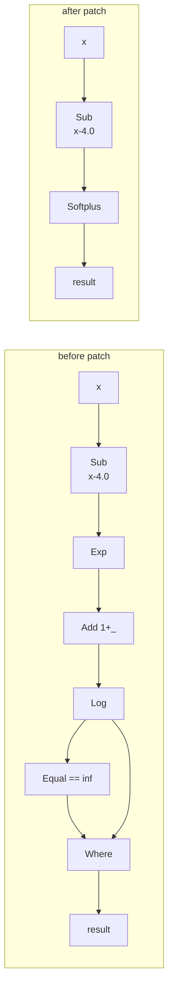

| op | Patch 前 | **Patch 後** | 削減 |
|---|---|---|---|
| Log | 80 | **0** | -80 |
| Exp | 96 | 16 | -80 |
| Equal | 90 | 10 | -80 |
| Where | 90 | 10 | -80 |
| Softplus | 0 | **80** | +80(NPU 対応) |

**`Balancer` / `Whiten` も Identity に置換**(学習用の gradient 調整で、推論時は no-op で OK):

```python
for name, m in model.named_modules():
    if m.__class__.__name__ in ("Balancer", "Whiten"):
        m.forward = (lambda self, x: x).__get__(m, m.__class__)
```

### 4.3 ② グラフ整形 — 4 つのサブステップ

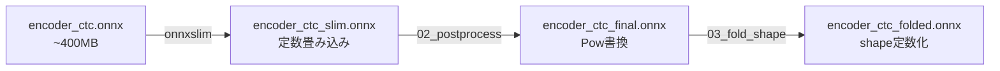

#### 4.3.1 onnxslim — 一般的な ONNX 最適化

不要な Cast/Identity 除去、連続 Reshape の融合、定数の畳み込み。pulsar2 内部も使うが、事前にかけることでビルドが安定。

#### 4.3.2 Pow(-0.5) → Sqrt + Div(1, _) 書換(`02_postprocess_onnx.py`)

pulsar2 の `AxPow` op は **指数が {0.25, 0.5, 2, 4} のみ対応**、負指数不可。LayerNorm の rsqrt 計算 `x^(-0.5)` がそのままでは扱えない:

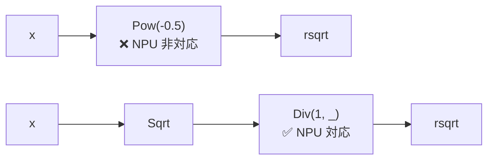

数学的に等価:`x^(-0.5) = 1/√x`

#### 4.3.3 動的 shape の定数化(`03_fold_shape_args.py`)

Reshape/Expand の shape 引数が `Shape → Gather → Concat` 経由で計算されているケース。入力が固定 shape なら結果も静的なので、ONNXRuntime で実評価して定数として埋め込む:

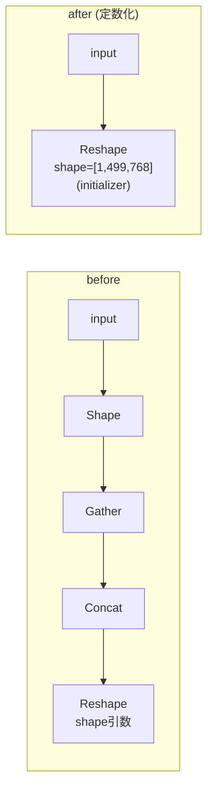

### 4.4 ③ 量子化 — FP32 から U16 へ

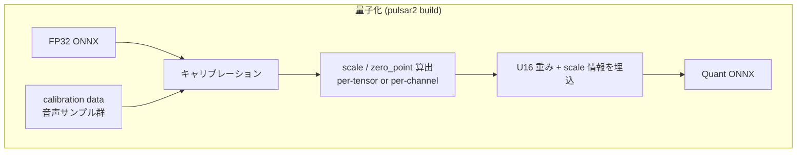

#### 量子化の数式

```
fp32_value ≈ scale × (uint16_value - zero_point)
uint16_value = round(fp32_value / scale) + zero_point
```

例: 範囲 `[-2.0, +2.0]` を U16 で表現する場合
- `scale = 4.0 / 65535 ≈ 0.000061`
- `zero_point = 32768`(中央値)
- 量子化解像度 ≈ 6.1e-5(これより細かい変化は失われる)

#### キャリブレーションの役割

各テンソルの動作範囲を実音声データで測定し、scale/zero_point を最適化:

```
                                        実測分布
                          ┌─────────────────────────┐
                          │     ██                  │
                          │    ████                 │ ← test.wav の出力分布
                          │   ██████                │
                          │  ████████               │
                          │ ██████████              │
                          │████████████████████████│
                          └─────────────────────────┘
                          -2.0     0     +2.0
                          ↑                  ↑
                         min               max
                         を測ってこの範囲を U16 全範囲に割当
```

我々の最適化:
- **Percentile** calibration(外れ値 0.01% を切る)
- **smooth_quant**(activation の外れ値を weights に転嫁)
- 24 種類の入力 perturbation(gain, noise, padding 違い)

### 4.5 ④ NPU compile — mcode 生成

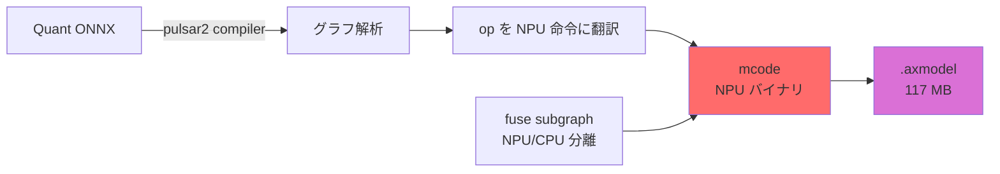

`.axmodel` の中身:
- **NPU mcode**: AX650 NPU 専用のバイナリ命令列
- **重み**: U16 量子化済み
- **シェイプ情報**: 各テンソルの dimension / stride / メモリ配置
- **メタデータ**: 入出力名、scale/zero_point、subgraph 情報

---

## 5. 量子化の仕組み

### 5.1 なぜ U16 で精度が出るのか

```
FP32 表現域:    [-3.4e38, +3.4e38]   実数の連続
U16 表現域:     [0, 65535]            65536 段階の整数

しかし、ニューラルネットの中間 activation は実は狭い範囲しか使ってない:
                                                  
   value                                          
     │            ●●                              
     │          ●●●●●●●                          
     │        ●●●●●●●●●●                          
     │       ●●●●●●●●●●●●●                        
     │      ●●●●●●●●●●●●●●●                      
   ──┼───────────────────────────── frequency
     -1     -0.5     0    0.5    1               
                                                  
   ← この狭い範囲(99%)に U16 を割り当てれば、十分な解像度  
```

### 5.2 量子化誤差の累積

`precision_analysis_table.txt` から得た cos 類似度の分布:

| レイヤー深さ | cos sim 中央値 | 解釈 |
|---|---|---|
| 入力近傍 | 0.999 | ほぼ無誤差 |
| 中盤 | 0.97-0.99 | 軽微な誤差累積 |
| 深い attention | 0.85-0.95 | 個別 Linear で誤差大 |
| **最終 logits** | **0.98** | **下流で誤差が相殺** |

→ 中間で大きく誤差が出ても、CTC 出力では十分な精度。

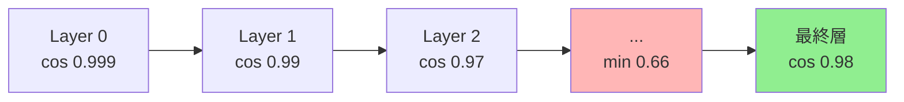

---

## 6. サブグラフ問題

### 6.1 NPU/CPU 分離

ONNX の op はすべて NPU で実行できるとは限りません。pulsar2 は op を分類:

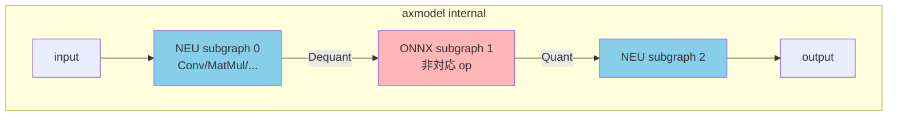

- **NEU subgraph**: NPU mcode で実行 → 高速
- **ONNX subgraph**: AX650 内蔵 ARM A55 CPU で実行 → 遅い
- 境界に Dequant/Quant + DMA コピー発生

### 6.2 我々が直面した問題

最初の build では **19 サブグラフ** に分割され、AX650N PCIe runtime がロード失敗(板側 worker が SIGTERM で死亡):

```
[NEU] → [ONNX(Log)] → [NEU] → [ONNX(Exp)] → [NEU] → ... × 19
                                                      
runtime: "こんなに分割された axmodel は処理できない"   
       → board worker process SIGTERM            
```

### 6.3 解決:NPU 完結化

ONNX 側の整形(SwooshLForward 置換 / Pow 書換 / Balancer no-op 化)で **すべて NPU 対応 op に統一**:

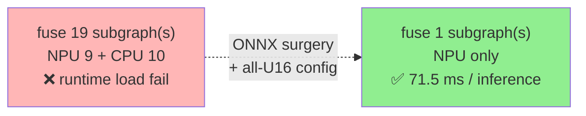

### 6.4 教訓:`data_type: FP32` 禁忌

pulsar2 config で `op_type: "Add", data_type: "FP32"` のような指定をすると、その op が CPU 行きになり subgraph 爆発。**今回は使わない**:

```json
// ❌ 悪い例
"layer_configs": [
  {"op_type": "Add", "data_type": "FP32"},     // attention 残差 80+ 個が CPU 行き
  {"op_type": "Softmax", "data_type": "FP32"}  // softmax 16 個も CPU 行き
]

// ✅ 良い例
"layer_configs": [
  {"start_tensor_names": ["DEFAULT"], "end_tensor_names": ["DEFAULT"],
   "data_type": "U16"}  // 全部 U16、subgraph 1個
]
```

---

## 7. 変換前後の比較

### 7.1 性能比較

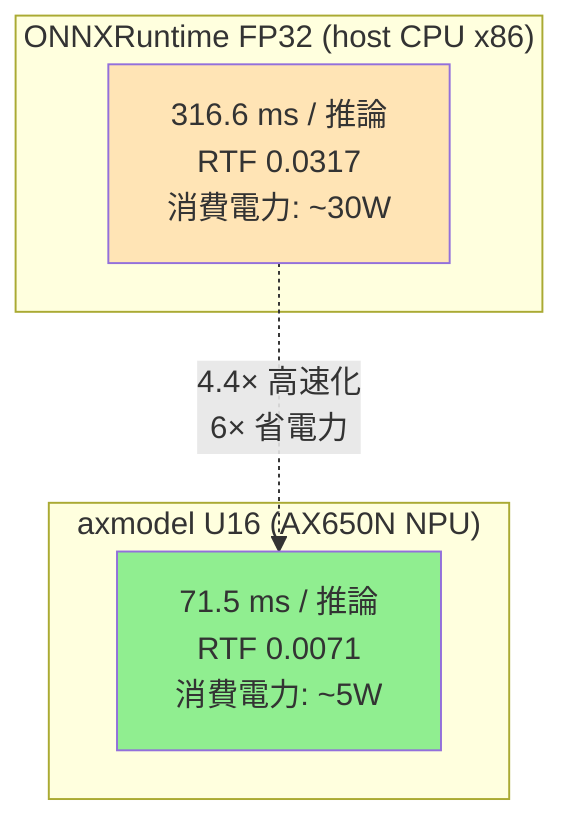

### 7.2 認識結果の一致性

```
入力音声: test.wav (3.5秒、「こんにちは…テストです」)

[ONNX FP32 CPU]   → こんにちはこれはテキスト読み上げのテストです
[axmodel U16 NPU] → こんにちはこれはテキスト読み上げのテストです
                                                              
                    ✅ 完全一致
                    
output tensor cos sim: 0.9879
max abs diff:         40.15  (logits は softmax 前の生 score なので絶対値はあまり気にしない)
```

### 7.3 モデルサイズ

| 形式 | サイズ | 圧縮率 |
|---|---|---|
| PyTorch (safetensors) | 約 240 MB | 1.0× |
| ONNX FP32 (外部 data 込) | 約 404 MB | 0.6× (展開で増) |
| **axmodel U16** | **117 MB** | **2.1× 圧縮** |

### 7.4 変換工数

| 段階 | 所要時間 |
|---|---|
| PyTorch → ONNX | ~1 分 |
| ONNX 整形 (slim + post + fold) | ~3 分 |
| Calibration data 生成 | ~10 秒 |
| **pulsar2 build (量子化 + compile)** | **~20 分** |
| 合計 | 約 25 分 |

---

## 8. まとめ

### 8.1 やってよかった工夫

1. **`scaling_converter` 相当を HF モデルに適用** — Balancer/Whiten/Swoosh patch で 80×4 個の Log/Exp/Equal/Where を消滅
2. **`dynamo=False` + `is_tracing=True` 強制** — Loop/If を完全排除
3. **すべて U16(FP32 op_type を使わない)** — subgraph 1 個達成、AXCLRT runtime 互換
4. **Percentile calibration + smooth_quant** — 量子化精度 cos 0.99 確保
5. **`Pow(-0.5) → Sqrt + Div(1,_)`** — pulsar2 で扱える形に
6. **動的 shape の事前定数化** — pulsar2 ビルド時の落ちを回避

### 8.2 やってはいけなかった工夫

1. **`op_type: "FP32"` 指定** — subgraph 爆発、runtime load 不可
2. **silence padding を zero で** — attention が壊れて「こん」脱落
3. **calibration data に test.wav 1件だけ** — 量子化分布が偏り cos 0.30
4. **モデルを 3 分割** — CTC モデルは1 axmodel で完結すべき

### 8.3 一般化できる教訓

NPU 向けモデル変換は **「数学的に等価で、ONNX 表現が単純で、量子化に強い形」** を作る作業:

```
   PyTorch (学習用)         ONNX (NPU 用)
   ─────────────             ─────────────
   • numerical stability      • single op で表現
   • 勾配を細かく制御         • static shape
   • 学習中の自己調整         • 量子化耐性ある分布
   • 多くのカスタムモジュール → 標準 op + 数学的等価変形
```

特に zipformer / wav2vec2 系の ASR モデルは、icefall の `scaling_converter.convert_scaled_to_non_scaled` のような**「学習用モジュールを推論用に置換する」前処理**が必須。HF Transformers 形式のモデルにも同じ思想を適用すれば NPU 化可能。

### 8.4 数字で見る成果

- **取り組み開始時の状態**: PyTorch でしか動かない
- **取り組み後の状態**: AX650N PCIe で **71.5 ms / RTF 0.0071** の実機推論
- **CPU 比 4.4 倍速、6 倍省電力**
- **認識結果は FP32 と完全一致**

エッジ ASR への道は遠く、しかし辿れる。

---

## 付録: 用語集

| 用語 | 意味 |
|---|---|
| **NPU** | Neural Processing Unit(AI 専用アクセラレータ) |
| **AX650N** | AXera-tech の NPU SoC(3 NPU core + 8 ARM A55) |
| **axmodel** | AXera 専用モデルフォーマット |
| **pulsar2** | AXera 公式のモデルコンパイラ |
| **AXCLRT** | AX Computing Language Runtime(host-board 通信) |
| **CTC** | Connectionist Temporal Classification(時系列分類) |
| **Zipformer** | k2-fsa の音声認識用 transformer 変種 |
| **CMM** | Carve-out Memory Module(NPU 専用メモリ領域) |
| **RTF** | Real Time Factor(処理時間 ÷ 音声長、小さいほど速い) |
| **mcode** | NPU 専用のマイクロコード |
| **subgraph** | グラフを実行単位に分割したもの(NPU/CPU の境界で分割) |
